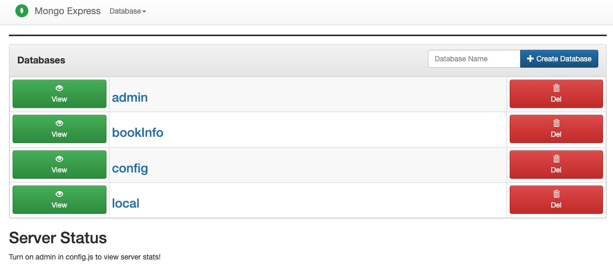
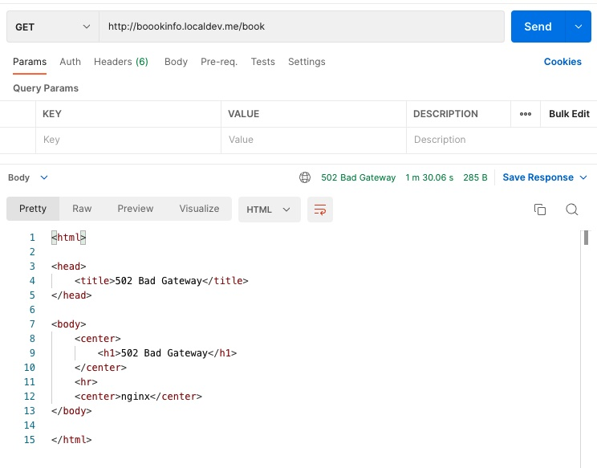

# BookInfo API

Besides the expected functional endpoints, the API will expose these endpoints for the following purposes:

| Path            | Purpose             |
|-----------------|---------------------|
| `/metrics`      | The metrics endpoint will be exposing metrics of the API to be consumed by Prometheus | 
| `/health/live`  | This endpoint will be the liveness probe's target. It returns 200 OK if the server is up and running |
| `/health/ready` | This endpoint will be the readiness probe's target. It checks the database connection and returns `200 OK` if connection is good |
| `/version`      | This endpoint simply reads the version.txt file inside the static folder. Normally version.txt will contain a token instead of a version number which can be replaced by the pipeline |
| `/docs`         | This endpoint uses redoc interface to show the OpenAPI documentation of the API |

### Prerequisites
In order to put some load on the API, `hey` tool should be installed on the client. 
https://github.com/rakyll/hey

## Initial state
There are two services named bookInfoAPI and bookStockAPI. bookInfoAPI has two endpoints namely `/book` and `/book/{id}`. The first loads all the book information from the backing MongoDB database. The latter loads the book information from the MongoDB with the given `{id}` and also loads its current stock count from `bookStockAPI` using its `/book{id}` endpoint. bookStockAPI loads stock information from its backing Redis database.
These databases come with their preloaded data, so the services should be working when they are first deployed.

When the application stack is deployed through yaml files in the `k8s/initial` folder, there should be 6 pods running and 6 deployments in the namespace.
|NAME                            | READY  | STATUS   | RESTARTS     | AGE  |
|--------------------------------|--------|----------|--------------|------|
|stockapi-7f88f897db-xz7ls       | 1/1    | Running  |  0           |  28m |
|redis-794b86ddbd-6b94t          | 1/1    | Running  |  0           |  28m |
|mongodb-598cb69f49-bvbh2        | 1/1    | Running  |  0           |  28m |
|stockapi2-7bdfc4d5d9-l9vhk      | 1/1    | Running  |  0           |  28m |
|mongo-express-5c854f97c7-zssxz  | 1/1    | Running  |  0           |  28m |
|infoapi-66548f599d-62lmh        | 1/1    | Running  |  0           |  21m |

|NAME                            |READY   |UP-TO-DATE   |AVAILABLE   |AGE|
|--------------------------------|--------|-------------|------------|---|
|deployment.apps/stockapi        |1/1     |1            |1           |33m|
|deployment.apps/redis           |1/1     |1            |1           |33m|
|deployment.apps/mongodb         |1/1     |1            |1           |33m|
|deployment.apps/stockapi2       |1/1     |1            |1           |33m|
|deployment.apps/mongo-express   |1/1     |1            |1           |33m|
|deployment.apps/infoapi         |1/1     |1            |1           |33m|

There should be 5 services and 2 ingress definitions in the namespace.
|NAME                    |TYPE        |CLUSTER-IP      |EXTERNAL-IP   |PORT(S)     |AGE|
|------------------------|------------|----------------|--------------|------------|---|
|service/mongodb         |ClusterIP   |10.43.106.107   |<none>        |27017/TCP   |33m|
|service/mongo-express   |ClusterIP   |10.43.144.14    |<none>        |8081/TCP    |33m|
|service/redis           |ClusterIP   |10.43.76.188    |<none>        |6379/TCP    |33m|
|service/infoapi         |ClusterIP   |10.43.238.140   |<none>        |5550/TCP    |33m|
|service/stockapi        |ClusterIP   |10.43.92.60     |<none>        |5555/TCP    |33m|

|NAME           |CLASS   |HOSTS                   |ADDRESS        |PORTS   |AGE|
|---------------|--------|------------------------|---------------|--------|---|
|mongoexpress   |nginx   |mexpress.localdev.me    |192.168.5.15   |80      |37m|
|ingress        |nginx   |boookinfo.localdev.me   |192.168.5.15   |80      |37m|

Mongoexpress can be used to check whether MongoDB is up and running, and the initial data is there. When the URL `http://mexpress.localdev.me` visited the following screen must be visible.

But when we try to access out API thoough the URL `http://boookinfo.localdev.me/book` we get a 502 Bad Gateway error.

Now it's up to us to fix this issue and apply necessary precautions to prevent this from happening again.