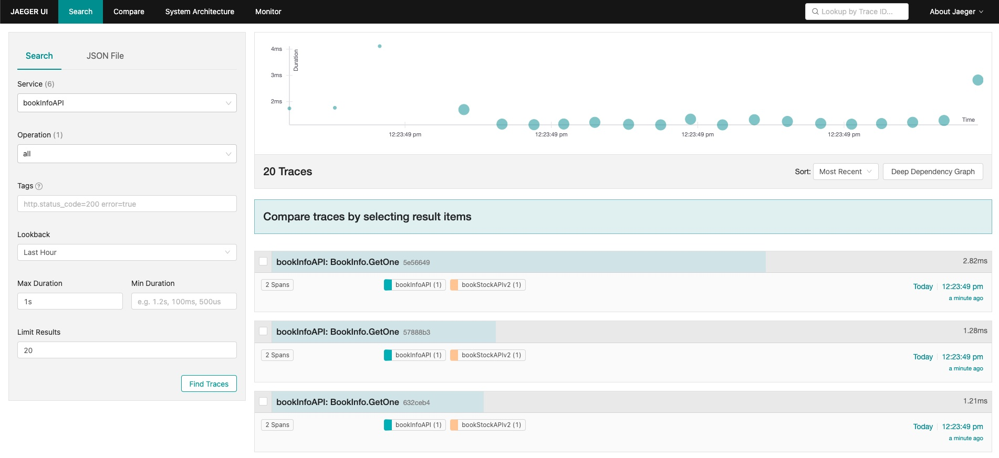
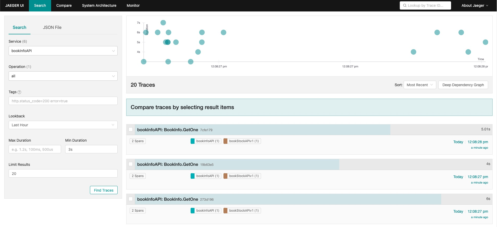

# BookInfo API

⚠️ WARNING: This file explains steps to be taken to complete the lab. Do not read this file until you have attempted the lab yourself.

## Step 9: Check the single book information
We have to make sure the other endpoints are working as well. Let's try to get the information of a single book.
```bash
curl http://bookinfo.localdev.me/book/5f1b9b9b9b9b9b9b9b9b9b9b
```
```bash
{"uuid":"5f1b9b9b9b9b9b9b9b9b9b9b","name":"Lord of the Rings: The Fellowship of the Ring","author":"J.R.R. Tolkien","currentStock":234}
```
It all works as expected, which means stockAPI also works. We can now move on to the next step. In which we will put the services under some load. For this we'll be using the `hey` tool. `hey` is a load testing tool written in Go. It is very easy to use and displays the results in a very readable format. 
```bash
hey -z 30s -c 50 -m GET http://boookinfo.localdev.me/book/636bd189db7a3afe9ac84af5
```
The status code distrubution shows that all oour requests returned successfully
```bash
Status code distribution:
  [200]	3808 responses
```
but the latency distribution shows that we have some problems with the response time.
```bash
Response time histogram:
  0.002 [1]	    |
  0.711 [3492]	|■■■■■■■■■■■■■■■■■■■■■■■■■■■■■■■■■■■■■■■■
  1.421 [0]	    |
  2.130 [0]   	|
  2.840 [0]	    |
  3.549 [59]   	|■
  4.259 [55]  	|■
  4.968 [0]   	|
  5.678 [76]  	|■
  6.387 [63]  	|■
  7.096 [62]    |■
```
We can clearly see that some requests took more than 3 seconds, up to 7 seconds to complete which is not acceptable. Let's try to find out what's going on.
First lets check the `/book` endpoint, because we know that this endpoint does not query the stockAPI, so we can rule out the stockAPI as the cause of the problem.
```bash
Response time histogram:
  0.001 [1]	    |
  0.034 [13319]	|■■■■■■■■■■■■■■■■■■■■■■■■■■■■■■■
  0.067 [17224]	|■■■■■■■■■■■■■■■■■■■■■■■■■■■■■■■■■■■■■■■■
  0.100 [3412]	|■■■■■■■■
  0.133 [612]	  |■
  0.166 [160]	  |
  0.199 [58]	  |
  0.232 [37]	  |
  0.264 [15]	  |
  0.297 [5]	    |
  0.330 [1]	    |
```
We can clearly see that the response time is very low, which means that the problem is not in the infoAPI. We have to check the stockAPI, but it does not have an ingress on its own.
We should notice there's a line in the log of the infoAPI mentioning tracer config not found on the environment variables. And if you set the log level to `Info` you'll see what environment variables have to be set in order to get the tracer working.
```bash
{"level":"error","time":"2022-11-16T08:23:08Z","message":"Cannot load tracer config from env"}
{"level":"info","time":"2022-11-16T10:26:07+01:00","message":"Tracer configuration can be set via the following environment variables JAEGER_AGENT_HOST - the host name of the jaeger agent JAEGER_AGENT_PORT - the port number of the jaeger agent JAEGER_SERVICE_NAME - the name of the service to report to the jaeger agent (e.g. bookInfoAPI)"}
```

## Step 10: Enter tracing
Tracing is a very useful tool to find out what's going on in your application. It allows you to see the flow of requests through your application. In this case we can see which requests are slow and which are fast. We can also see which requests are made to the stockAPI. We will be using Jaeger for this. Jaeger is an open source tracing system. It is very easy to use and has a very nice UI. It is also very easy to integrate with your application. We will be using the Jaeger All-In-One pod for its simplicity for demonstrative purpose only, but usually Jaeger Operator is used to install Jaeger. 
```bash
kubectl apply -f https://raw.githubusercontent.com/ContainerSolutions/bookinfo/main/k8s/final/08-jaeger-all-in-one.yaml
```
and we'll create an ingress for Jaeger to take a look at its UI.
```bash
kubectl apply -f https://raw.githubusercontent.com/ContainerSolutions/bookinfo/main/k8s/final/09-jaeger-ingress.yaml
```
Now we can add those environment variables to the API deployments (there should be 3 of them), which automatically restart the corresponding pods, and apply the load again.
```yaml
...
        - name: JAEGER_AGENT_HOST
          value: jaeger-agent
        - name: JAEGER_AGENT_PORT
          value: "6831"
        - name: JAEGER_SERVICE_NAME
          value: bookInfoAPI
...
```
## Step 7: Check the traces
Now in the Jaeger UI, let's try to find out what makes some of the requests to the `/book/{id}` endpoints so slow. What's the difference between slow ones and the fast ones? We can set the Max and Min duration filters to see them separately.


It's easy to see that the slow requests call a different version of the stockAPI. It looks like there are two versions deployed, and there's an obvious improvement in the new version. But when we take a look at the services deployed in the cluster, we can see that there's only one service for the stockAPI called `stockapi`. Let's inspect it and find out why it redirects some of the requests to the old version.
```bash
kubectl get svc stockapi -o yaml
```
```yaml
apiVersion: v1
kind: Service
metadata:
  labels:
    app: stockapi
    layer: api
  name: stockapi
  namespace: bookinfo
  resourceVersion: "311459"
spec:
  clusterIP: 10.43.152.152
  clusterIPs:
  - 10.43.152.152
  internalTrafficPolicy: Cluster
  ipFamilies:
  - IPv4
  ipFamilyPolicy: SingleStack
  ports:
  - name: web
    port: 5555
    protocol: TCP
    targetPort: 5555
  selector:
    app: stockapi
  sessionAffinity: None
  type: ClusterIP
```
The `selector` of the service is `app: stockapi`, which means that it will redirect all the requests to the pods with the label `app: stockapi`. Let's find which pods match the description.
```bash
kubectl get pods -l app=stockapi
```
```bash
NAME                         READY   STATUS    RESTARTS   AGE
stockapi-df585bc95-p4qqr     1/1     Running   0          41m
stockapi2-64c4b4db69-x5vlm   1/1     Running   0          41m
```
It macthes two pods, each from different deployments. Let's check the labels of the pod templates of these deployments.
```bash
kubectl describe deploy stockapi
```
```yaml
Pod Template:
  Labels:  app=stockapi
```
```bash
kubectl describe deploy stockapi2
```
```yaml
Pod Template:
  Labels:  app=stockapi
           version=2
```
Clearly when someone deployed the new version, for some reason left the old version still running, but added a new label to the new version to separate it from the older one. But unfortunately forgot to add this new label to the `selector` of the service. Let's add it and check if all the requests go to the new version.
```bash
kubectl patch svc stockapi -p '{"spec":{"selector":{"app":"stockapi","version":"2"}}}'
```
then run the load again
```bash
hey -z 30s -c 50 -m GET http://boookinfo.localdev.me/book/636bd189db7a3afe9ac84af5
```
to see that all the requests are now fast.
```bash
Summary:
  Total:	30.0385 secs
  Slowest:	0.3552 secs
  Fastest:	0.0057 secs
  Average:	0.0838 secs
  Requests/sec:	596.0346

  Total data:	1790400 bytes
  Size/request:	100 bytes

Response time histogram:
  0.006 [1]	    |
  0.041 [2068]  |■■■■■■■■■■■■
  0.076 [6883]  |■■■■■■■■■■■■■■■■■■■■■■■■■■■■■■■■■■■■■■■■
  0.111 [5081]  |■■■■■■■■■■■■■■■■■■■■■■■■■■■■■■
  0.145 [2364]  |■■■■■■■■■■■■■■
  0.180 [983]   |■■■■■■
  0.215 [301]   |■■
  0.250 [102]   |■
  0.285 [73]    |
  0.320 [41]    |
  0.355 [7]     |
```